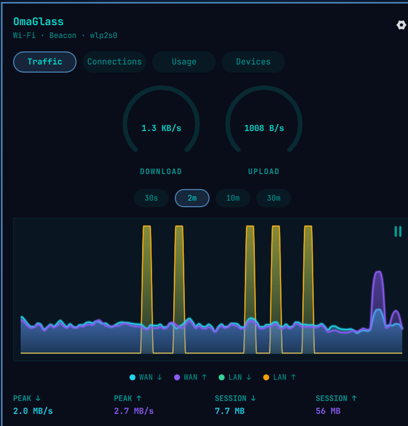
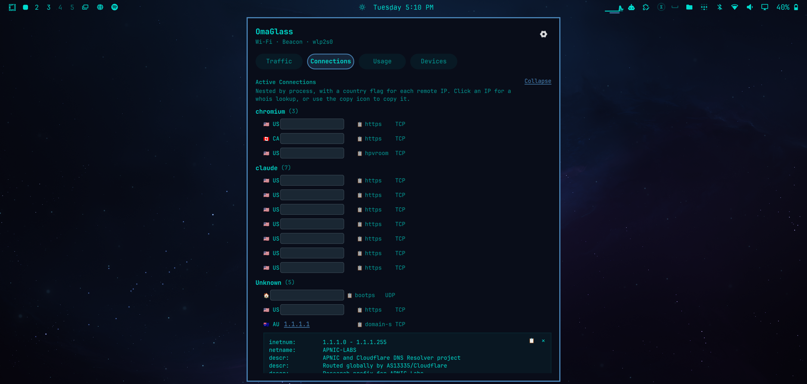
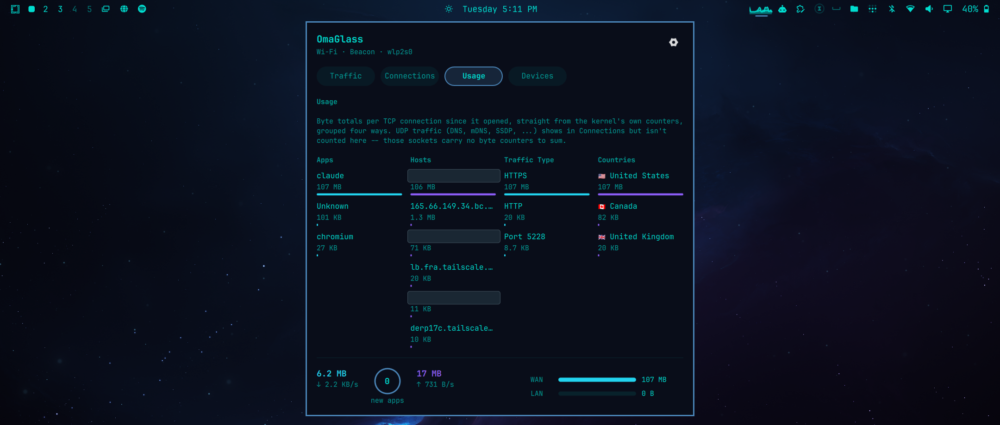
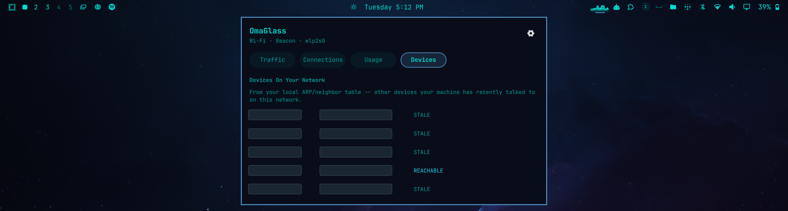
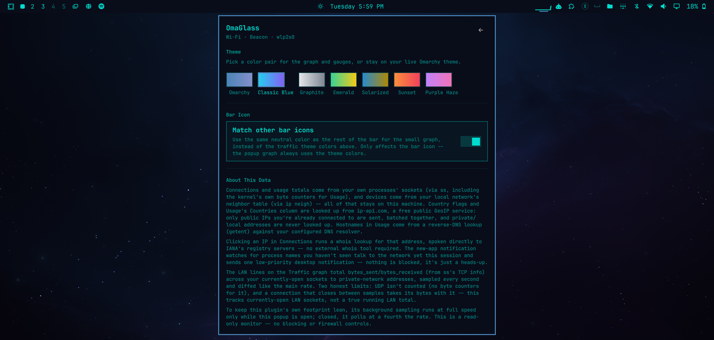

# OmaGlass

A live network traffic monitor for the [Omarchy](https://omarchy.org/) shell —
speed gauges, a history graph, active connections with country lookups and
on-demand whois, per-app/host/type/country usage breakdowns, and LAN device
discovery. Read-only: no firewall or blocking controls.



## Features

- **Live speed gauges** for download/upload, with an auto-expanding scale.
- **A smooth history graph** (30s/2m/10m/30m windows) plotting WAN and LAN
  traffic as separate lines, with a hover tooltip and a pause button to
  freeze the graph on a burst without pausing the live gauges/stats behind
  it.
- **A tiny live graph right in the bar icon**, with a per-theme color pair or
  a neutral "match the other icons" mode (your choice, in Settings).
- **Active Connections**, nested by process, each remote IP flagged by
  country. Click an IP for an on-demand whois lookup (with its own copy and
  close controls), or use the copy icon to copy the address straight to your
  clipboard.
- **Usage** breakdowns of real kernel byte counters by app, host, traffic
  type, and country.
- **Devices** on your LAN, from your local ARP/neighbor table.
- **A discreet notification** the first time a new process starts talking to
  the network each session.
- **Color themes** for the graph/gauges — pick a fixed pair, or stay on your
  live Omarchy theme (the default).

|                                              |                                            |
| -------------------------------------------- | ------------------------------------------ |
|  |  |
|       |       |

The bar icon sits alongside your other bar widgets:


## Installation

```bash
omarchy plugin add https://github.com/cjohnson46/omarchy-omaglass.git --enable
```

You'll be prompted to review the plugin before it's added (plugins run as
unsandboxed code — see [Data & Privacy](#data--privacy) below for exactly
what this one does). Say yes to enabling it, and pick a bar section when
asked.

### Requirements

None — nothing to install beyond the command above. OmaGlass shells out to
standard system tools that already ship with a stock Omarchy install, and
speaks the whois protocol itself over a raw socket rather than depending on
a separate `whois` package:

| Tool | Used for |
| --- | --- |
| `omarchy-network-status` | Interface/link status (ships with Omarchy) |
| `ss` (iproute2) | Connection list and byte-counter sampling |
| `ip` (iproute2) | LAN neighbor discovery |
| `getent` (glibc) | Reverse-DNS hostnames in Usage |
| `curl` | Batched GeoIP lookups |
| `wl-copy` (wl-clipboard) | Clipboard copy actions |
| `bash` (`/dev/tcp`) | On-demand IP whois lookups from Connections |

## Removal

```bash
omarchy plugin remove io.github.cjohnson46.omaglass
```

## Data & Privacy

- Connections, usage, and device data all come from your own machine (`ss`,
  `ip neigh`) — none of it leaves your computer.
- Country flags and Usage's Countries column come from
  [ip-api.com](https://ip-api.com), a free public GeoIP service: only public
  IPs you're already connected to are sent, batched together. Private/local
  addresses are never looked up.
- Whois lookups speak the whois protocol directly to IANA's registry
  servers for the address you clicked (no external `whois` binary).
- Reverse-DNS hostnames come from `getent` against your own configured DNS
  resolver.
- Background sampling runs at full speed only while the popup is open;
  closed, it polls at a quarter of the rate to stay light.

## License

MIT — see [LICENSE](LICENSE).
